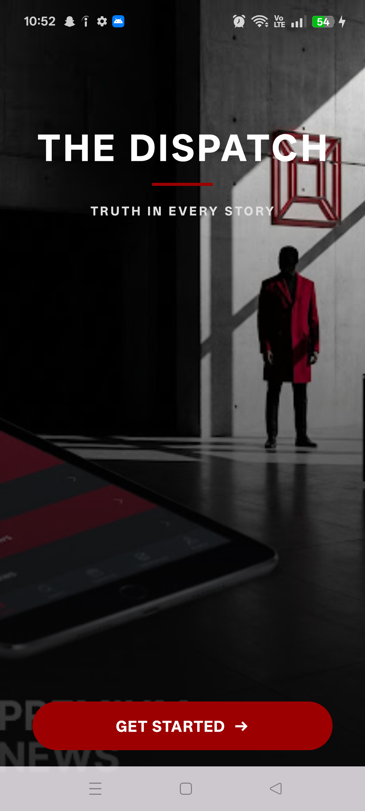
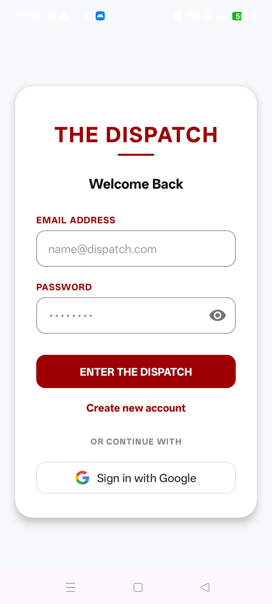
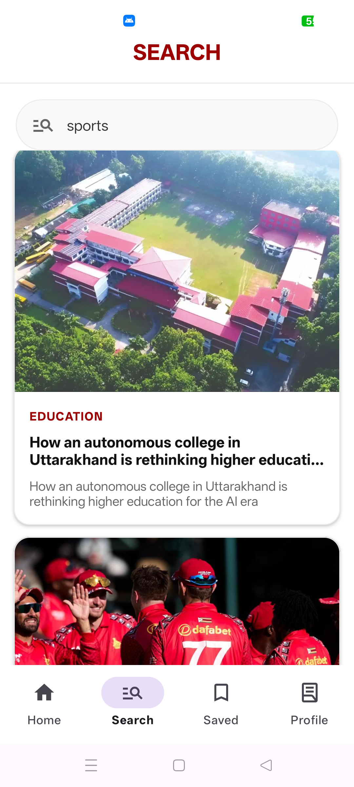
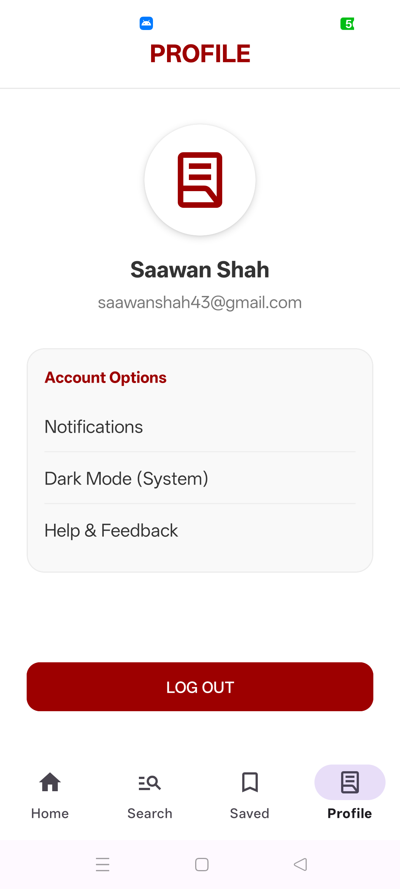

# 📰 DispatchX

<p align="center">
  <h3 align="center">Modern Android News Application</h3>
  <p align="center">
    Built with Kotlin, MVVM, Coroutines, Retrofit & Firebase Authentication
  </p>
</p>

<p align="center">


</p>

---

# 📖 About

DispatchX is a modern Android News Application developed using **Kotlin** and **MVVM Architecture**. The application delivers real-time news from multiple categories using REST APIs while providing a clean, responsive, and user-friendly interface.

The project demonstrates modern Android development practices including Firebase Authentication, Coroutines, Retrofit networking, Repository Pattern, Navigation Component, and Material Design 3.

---

# ✨ Features

- 🔐 Firebase Authentication
- 🔑 Google Sign-In
- 🚀 Splash Screen
- 👤 User Session Management
- 📰 Breaking News
- 📚 Category-wise News
- 🔍 Search News
- ⭐ Bookmark News
- 👤 Profile Screen
- 🌐 REST API Integration
- ⚡ Kotlin Coroutines
- 🏗 MVVM Architecture
- 📦 Repository Pattern
- 🖼 Glide Image Loading
- 📄 RecyclerView
- 🧭 Navigation Component
- 🎨 Material Design 3
- ❌ Error Handling
- ⏳ Loading Indicator

---

# 🛠 Tech Stack

- Kotlin
- Android SDK
- MVVM Architecture
- ViewModel
- LiveData
- Coroutines
- Retrofit
- Gson
- Firebase Authentication
- Google Sign-In
- Glide
- RecyclerView
- Navigation Component
- View Binding
- Material Design 3
- Git & GitHub
- Gradle

---

# 🏗 Architecture

```
           UI (Fragments)
                  │
                  ▼
            ViewModel
                  │
                  ▼
            Repository
                  │
                  ▼
          Retrofit Network
                  │
                  ▼
              News API
```

---

# 📸 Screenshots

| Splash Screen | Login Screen |
|---------------|--------------|
|  |  |

| Home Screen | Profile Screen |
|-------------|----------------|
|  |  |

---

# 🚀 Getting Started

### Clone the repository

```bash
git clone https://github.com/SaawanShah/DispatchX.git
```

### Open the project

Open the project using **Android Studio**.

### Sync Gradle

Allow Gradle to download all required dependencies.

### Configure Firebase

1. Create your own Firebase project.
2. Download `google-services.json`.
3. Place it inside:

```
app/google-services.json
```

### Configure News API

Add your News API key inside:

```
NewsConstants.kt
```

### Run the application

Build and run the project on an emulator or Android device.

---

# 🔮 Future Improvements

- 🌙 Dark Mode
- ❤️ Room Database for Offline Bookmarks
- 🔔 Push Notifications
- 📄 Pagination
- 🌍 Multi-language Support
- 📥 Offline Reading

---

# 🤝 Contributing

Contributions are welcome!

1. Fork this repository
2. Create a feature branch
3. Commit your changes
4. Push to your branch
5. Open a Pull Request

---

# 👨‍💻 Developer

## Saawan Shah

Android Developer

🔗 GitHub  
https://github.com/SaawanShah

💼 LinkedIn  
https://www.linkedin.com/in/saawan_shah_tech

---

<p align="center">

⭐ **If you like this project, don't forget to Star the repository!** ⭐

</p>
